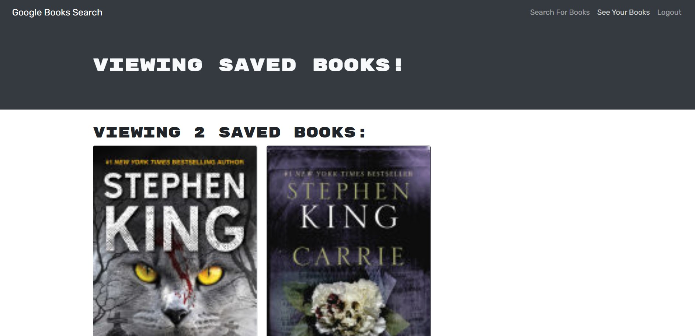

# Google Books Search

## License

## Description
A Google Books API Search engine built using the MERN stack and refactored to be a GraphQL API with Apollo Server.

Deployed application on heroku: https://google-books-search826364.herokuapp.com/

### Screenshots
#### Home

#### Saved Books

## Table of Contents
 * [Installation](#installation)
 * [Usage](#usage)
 * [Contributing](#contributing)
 * [Questions](#questions)
        
## Installation
Clone this repository and enter `npm install` in the terminal to install the necessary dependencies.
   
## Usage
Enter `npm run develop` from the root directory to start the development server on `http://localhost:3000/` and use GraphQL at `http://localhost:3001/graphql`.

## Contributing
Charity Rogers

## Questions
If you have any questions, please contact me!

  - GitHub: https://github.com/rogerscl116
  - Email: rogerscl116@gmail.com 
